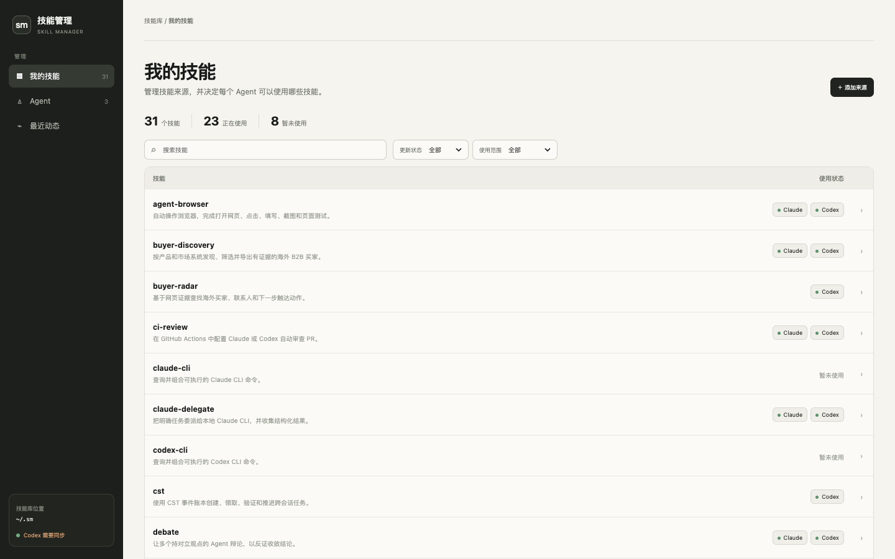
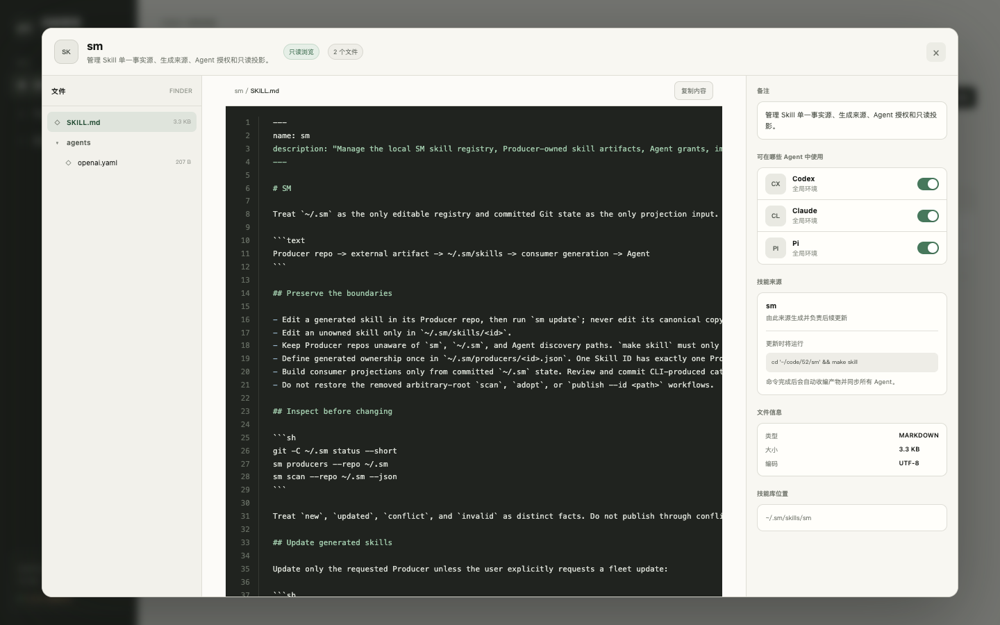
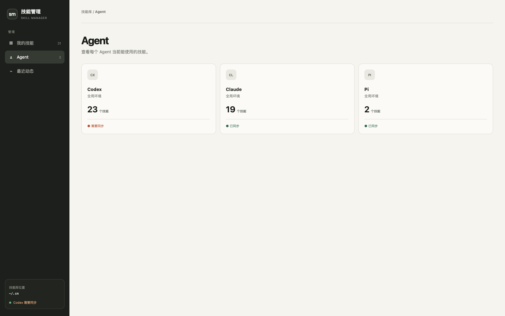

# sm

[](https://github.com/yansircc/skill-manager/actions/workflows/ci.yml)
[](https://pkg.go.dev/github.com/yansircc/skill-manager)
[](LICENSE)

`sm` is a local, Git-backed single source of truth for Agent Skills. It builds immutable, least-authority skill projections for Codex, Claude, Pi, and ordinary directories.

```text
Producer repository ──build──> external artifact
external artifact ──publish──> ~/.sm/skills
committed Git tree ──build──> immutable generation ──activate──> Agent
```

The editable truth lives in one place. Producer outputs cannot become Agent discovery roots, and consumers are built only from committed catalog state.

## Dashboard

The skill catalog shows ownership notes, update state, and the Agent environments currently using each Skill.



Open any Skill to browse its canonical files read-only, inspect highlighted source, manage Agent access, and run its declared Producer update.



Agent synchronization is derived from each consumer projection, so an out-of-date Agent is visible directly instead of being hidden behind a global status.



## Why

Agent tools discover skills through different directories and activation mechanisms. Copying skills into each tool creates multiple editable truths, stale copies, and unclear authorization.

`sm` separates four concerns:

- **Producer**: a trusted repository that builds one or more skill artifacts.
- **Catalog**: canonical skills and ownership declarations in a Git repository.
- **Consumer**: an explicit allowlist for one Agent environment.
- **Generation**: an immutable projection derived from a catalog commit.

## Requirements

- Go 1.25 or newer
- Git
- Node.js 22.12 or newer and npm, only when rebuilding the Dashboard
- Codex, Claude, or Pi only when using that Agent's adapter

## Install

```sh
go install github.com/yansircc/skill-manager/cmd/sm@latest
```

Or build from source:

```sh
git clone https://github.com/yansircc/skill-manager.git
cd skill-manager
npm ci --prefix dashboard
npm run build --prefix dashboard
go build -o sm ./cmd/sm
```

The compiled binary embeds the Dashboard; Node.js is not required at runtime.

## Quick start

Create the catalog and its first commit:

```sh
sm init ~/.sm
git -C ~/.sm add .gitignore
git -C ~/.sm commit -m "Initialize skill registry"
sm open --repo ~/.sm
```

`sm open` starts the Dashboard on `127.0.0.1:7777` and opens it in the default browser. Use `sm dashboard` to serve without opening a browser.

The Dashboard can register Producers, publish updates, grant skills to consumers, show the exact build command, and rebuild affected projections. Every mutation is committed to the catalog repository.

## Catalog layout

```text
~/.sm/
├── producers/
│   └── example.json
├── skills/
│   └── example/SKILL.md
├── consumers/
│   └── codex.global.json
└── .git/
```

Producer ownership is explicit:

```json
{
  "root": "/absolute/path/to/producer",
  "note": "Optional human-readable explanation shown in the Dashboard",
  "build": { "argv": ["make", "skill"] },
  "outputs": [{ "path": "dist/skill" }],
  "skills": ["example"]
}
```

The build command runs with `root` as its working directory. Outputs must remain outside the catalog. The emitted `SKILL.md` name must match the declared skill ID. When `note` is present, the Dashboard list shows it instead of the Skill description; the Skill artifact remains unchanged.

A consumer is an allowlist:

```json
{
  "adapter": "codex",
  "target": "~/.agents/skills",
  "skills": ["example"]
}
```

Supported adapters:

| Adapter | Activation |
| --- | --- |
| `directory` | Persistent symlink to an immutable generation |
| `codex` | Persistent target plus verified Codex discovery profile |
| `claude` | Ephemeral, closed profile through `sm exec` |
| `pi` | Ephemeral, closed invocation through `sm exec` |

## Commands

```sh
# Producers
sm producers --repo ~/.sm
sm producer relocate --repo ~/.sm <producer> <new-root>
sm scan --repo ~/.sm --json
sm produce --repo ~/.sm <producer>
sm publish --repo ~/.sm <producer>
sm update --repo ~/.sm <producer>

# Consumers
sm build --repo ~/.sm <consumer>
sm apply --repo ~/.sm <consumer>
sm verify --repo ~/.sm <consumer>
sm exec --repo ~/.sm <consumer> -- <agent arguments...>

# UI
sm open --repo ~/.sm
sm dashboard --repo ~/.sm --listen 127.0.0.1:7777
```

`producer relocate` handles a moved Producer checkout. It requires a clean SSOT, runs the existing build in the new root, validates the complete declared Skill set, and commits only the Producer locator. It does not change the catalog or Agent generations; run `update` separately when the artifact should change.

`scan` is read-only. `produce` only runs the configured Producer command. `publish` validates the complete owned artifact set and atomically replaces it in the catalog. `update` composes `produce -> scan -> publish`.

`build`, `apply`, `verify`, and `exec` read a Git commit, not uncommitted working-tree state.

## Trust and security

`sm` is a local compiler and activator, not a remote package registry or sandbox.

- Producer commands execute with the current user's privileges. Register only repositories you trust.
- Skills may contain executable files. Review Producer changes before publishing them.
- The Dashboard mutation API intentionally has no authentication and refuses non-loopback listen addresses. Do not expose it through a proxy or tunnel.
- Consumer allowlists constrain skill projection; they do not sandbox the Agent process.

See [SECURITY.md](SECURITY.md) for vulnerability reporting.

## Development

```sh
npm ci --prefix dashboard
npm run build --prefix dashboard
test -z "$(gofmt -l .)"
go vet ./...
go test ./...
go build ./cmd/sm
```

Dashboard output under `dashboard/dist` is tracked because it is embedded by Go. A frontend change is complete only when source and embedded output are updated together.

Contributions are welcome; read [CONTRIBUTING.md](CONTRIBUTING.md) first.

## License

MIT
